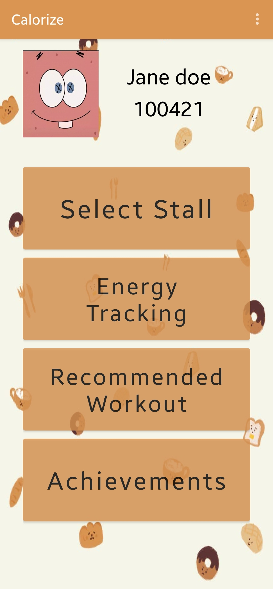
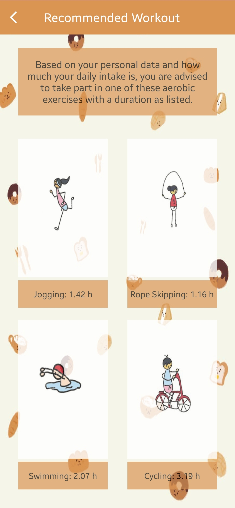

# Calorize

## Authors

- [He Haolan](https://github.com/darthnoward)
- [Placid Brain](https://github.com/placid-brain)
- [Wang Han](https://github.com/We-here)
- [Xu Song](https://github.com/XuSog)
- [Adler](https://github.com/Adler-p)

## Motivation

A healthy body is the key to success as all of us might know it. Yet many of us suffer from the ill consequences of our food choices. What is troubling is that we don’t go out of our way to consume unhealthy food but it is a matter of lack of accessibility. This is a widespread issue throughout the nation whereby only a handful of eateries label their foods’ nutrition information while the bulk of them go unrecorded. As a result, many consumers often make the wrong choices while planning for their meals. This inadvertently leads to an unbalanced diet which then results in an array of diseases and illnesses related to poor diet management. It has been reported that nearly 40% of the nation suffers from obesity which is only expected to rise further(Health Hub) and at least 440 000 Singaporeans are diabetic(MOH, 2016). Hence, our group felt that this is a pressing issue that requires immediate attention to stave off disastrous consequences in the future such as an unproductive workforce leading to a weak economy. As a result, we decided to act upon this problem from another yet familiar  perspective. 

## Solution Ideation

Our group has decided to come up with an Android app which stores information regarding nutrition information of food from each stall. This function will be coupled along with a reward system where users can unlock prizes after accomplishing a certain milestone or checkpoint for adhering to a suggested meal intake scheme deduced by their personal health details. Additionally, they will also be recommended an exercise regime to help abide by the system-generated meal intake suggestion. Moreover, the app will be complete with a profile set-up for personalisation. We decided to choose SUTD students as our target audience due to the fact that our own canteen stalls’ nutrition information is not accessible and the ease of implementation. Moreover, it is widely regarded that the youth are the future of the nation so by crafting an app for SUTDents we aim to make the student population more conscious of the choices they make on a daily basis and to promote a sustained balanced lifestyle in the long term.

## Download APK

Check out out latest release [here](https://github.com/sys1d/Calorize/releases/tag/1.0.0)!

## Sample Screenshots

---

---

---

---

---

---

---

---

## License
Licensed under the [MIT license](./LICENSE)
